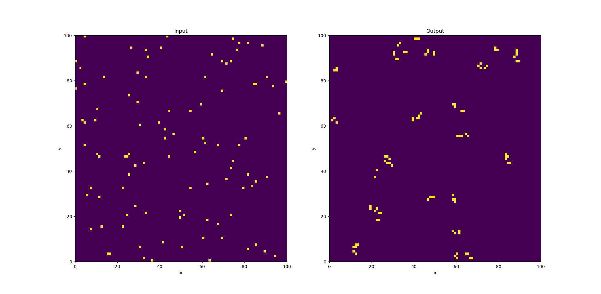

# Ant Colony

### Instalação e Requisitos

- Makefile
- golang 1.21
- python3
- numpy
- matplotlib


### Executar

```bash
$ go run main.go
```

ou se preferir com plot em python:

```bash
$ make
```

### Futuramente verificar as race condition das formigas

```bash
$ go run -race main.go
```


### Benchmark??

- Dar uma olhada no package `testing`

```
$ go test -bench=.
```


### TODO:

- [ ] Formigas paralelas

### FIXME:

- [ ] Quando termina a iteração, se a formiga estiver com o item ele sera perdido. 
- [ ] ...

### Testes realizados:

```text
    MATRIZ_SIZE       = 100
	NUMBER_OF_ANTS    = 20
	NUMBER_OF_ITEMS   = 100
	ANT_RANGE         = 2
	NUMBER_ITERATIONS = 100000
```


